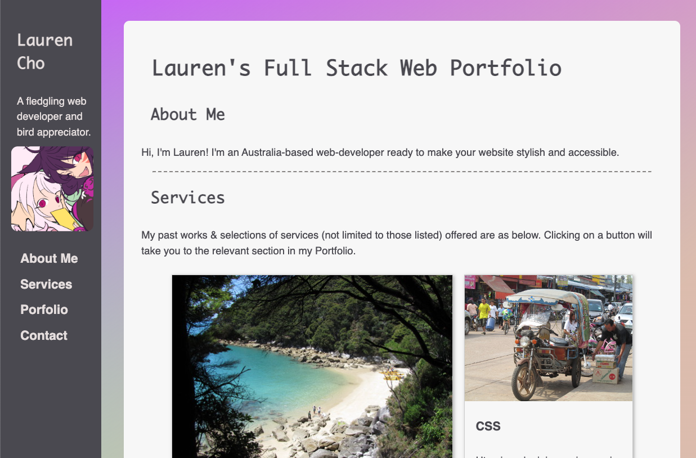
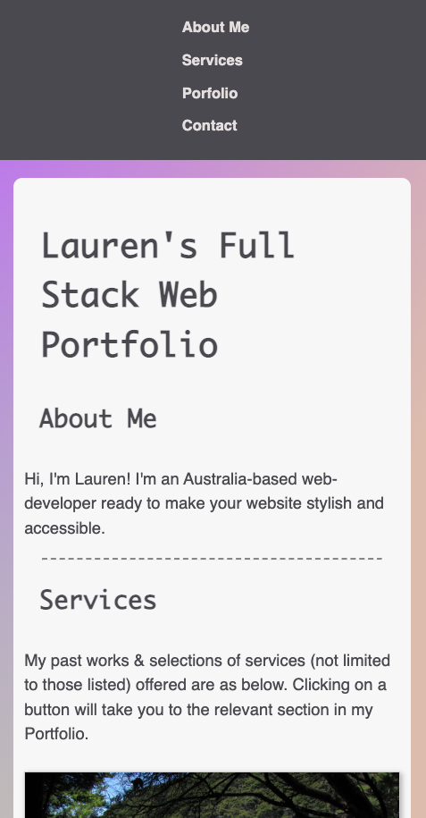

# Lauren-fullstack-portfolio

# Lauren's Full Stack Web Portfolio

## Description

This project will serve to showcase my abilities as a full-stack web developer, from HTML, CSS and beyond.

The repository will be updated progressively and continuously as I acquire additional skills, beyond my time as a student of the University of Adelaide coding bootcamp.

Refer to the 'Update notes' section to see my progression as a web developer.

- Link to the GitHub repository: <https://github.com/gh120515/Lauren-fullstack-portfolio>
- Link to the webpage: <https://gh120515.github.io/Lauren-fullstack-portfolio>

## Update notes

Last updated: May 2023

- version May 2023: Added link to 'Whiskers of Zen' project.

- version March 2023: Created the portfolio, to demonstrate and apply my current knowledge of HTML and CSS.

## Credits

Codes provided in the University of Adelaide Full-Stack Development bootcamp (course ID: UADEL-VIRT-FSF-PT-03-2023-U-LOLC-MTTH) was used as initial references & starting point in building the HTML and CSS codes used.

Additional code references include the following:

version 1 (current as of March 2023):
- 'Flexbox Cards' by Quackit: <https://www.quackit.com/css/flexbox/examples/flexbox_cards.cfm>
- 'How to Add an HTML Button that Acts Like a Link' by W3 docs: <https://www.w3docs.com/snippets/html/how-to-create-an-html-button-that-acts-like-a-link.html>
- 'How to Create CSS Animation on Scroll' by Oscar Jite: <https://alvarotrigo.com/blog/css-animations-scroll/>
- 'How TO - Contact Form' by W3 Schools: <https://www.w3schools.com/howto/howto_css_contact_form.asp>
- HTML 'Fixed Sidebar' by W3 Schools: <https://www.w3schools.com/howto/howto_css_fixed_sidebar.asp>
- 'Normalize.css' by Necolas <https://github.com/necolas/normalize.css/>
- 'Scrolling gradient' by Mike: <https://codepen.io/MadeByMike/pen/eKPZZz>
- 'Using CSS transitions' by MDN: <https://developer.mozilla.org/en-US/docs/Web/CSS/CSS_Transitions/Using_CSS_transitions>

## License

If not indicated, all codes are subject to MIT License. 
